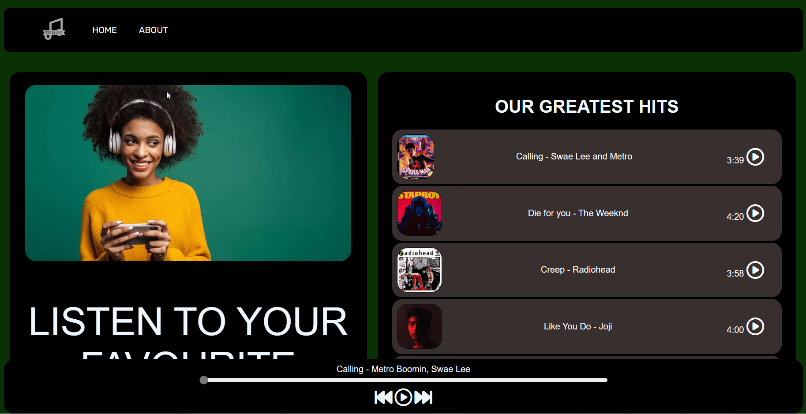

# Project Description

Melodify is my personal web application project, a Spotify clone that allows users to listen to a curated list of songs. I developed this project using HTML, CSS, and JavaScript, and aimed to showcase the implementation of a music player with a song list and play functionality.

# Features
- Display a list of songs with their titles and artists.
- Play and pause songs using the built-in music player.
- Track progress with a seek bar and display the current time of the song.
- Display song duration.
- Responsive design for a seamless experience across various devices.

# Result

